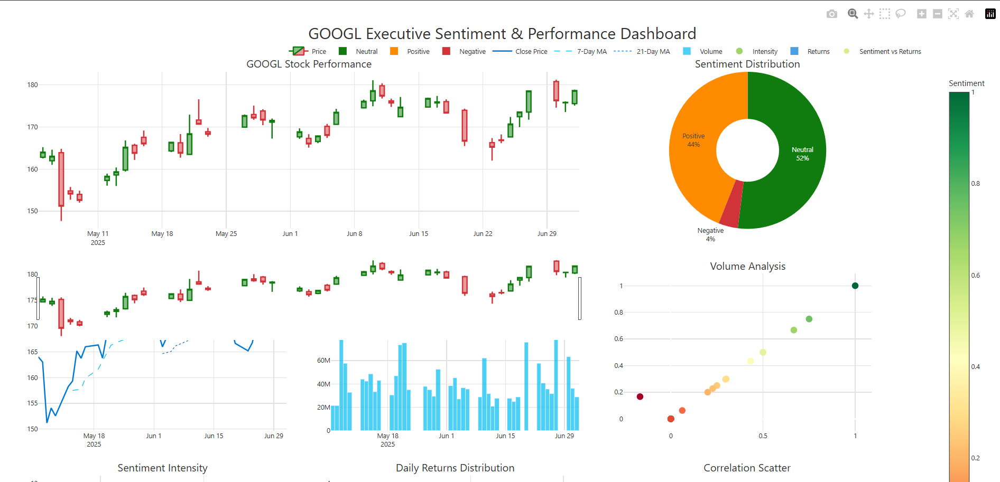
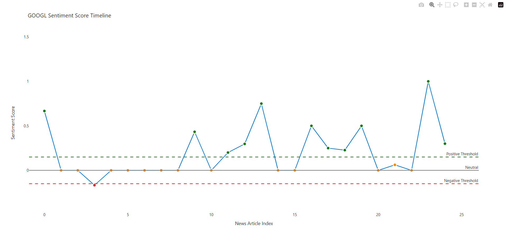

# 📊 Stock Market Sentiment Analysis Dashboard

A Python-based project that analyzes the sentiment of news headlines for a given stock (e.g., AAPL) and correlates it with real-time stock performance using advanced visualizations — inspired by Power BI dashboard aesthetics.

## 🚀 Features

- 🔍 **News Scraping** from Yahoo Finance (with mock fallback)
- 🧠 **NLP Sentiment Analysis** using TextBlob
- 📈 **Stock Data Analysis** using yFinance
- 📊 **Power BI-style Dashboards** via Plotly (Executive, KPI, Timeline, Correlation)
- 📉 Daily return tracking, moving averages, volatility indicators
- 📦 Modular and extendable class structure

## 🖼️ Dashboards Included

- 📌 Executive Overview (Candlestick, Pie Charts, KPIs)
- 📈 Sentiment Timeline (score evolution)
- 📊 Sentiment KPI Dashboard
- 📉 Sentiment vs Return Correlation (with R² metrics)

## ✅ Sample Output

📝 Notes
If web scraping fails, the script uses fallback headlines for demo

Requires an internet connection for scraping and yfinance

Sentiment analysis is basic but practical

Can be extended with advanced models (e.g., BERT, VADER, GPT)
